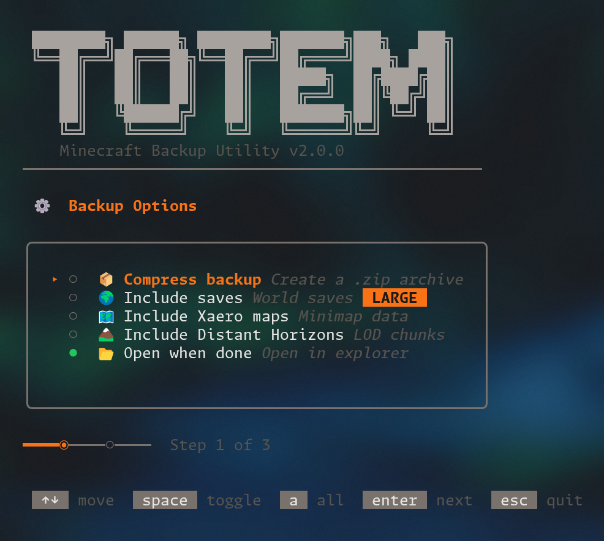

# 🗿 Totem

A beautiful TUI for backing up your Minecraft installation. Built with Go
and [Bubble Tea](https://github.com/charmbracelet/bubbletea).



## Features

- 🎮 **Interactive TUI** - Arrow keys to navigate, space to toggle options
- 📸 **Screenshots** - Full folder backup
- 📦 **Mods, Shaders, Resource Packs** - Saved as text lists for easy re-downloading
- ⚙️ **Shader Configs** - Copied to separate folder
- 🌍 **World Saves** - Optional full backup (can be large!)
- 🗺️ **Xaero's Maps** - Optional minimap data backup
- 🏔️ **Distant Horizons** - Optional LOD data backup
- 🗜️ **Zip compression** - Optional archive output
- 📂 **Auto-open** - Opens backup folder when done
- 📋 **Comprehensive info.md** - Backup metadata, stats, and restoration guide

## Installation

### Download Binary

Download the latest release for your platform from the [Releases](https://github.com/vaalley/totem/releases) page.

### Build from Source

```bash
# Clone the repo
git clone https://github.com/vaalley/totem.git
cd totem

# Build
go build -ldflags="-s -w" -o totem .

# Run
./totem
```

## Usage

Simply run the executable:

```bash
# Windows
.\totem.exe

# Linux/macOS
./totem
```

Use the interactive TUI to:
1. Select backup options (zip, saves, xaero, distant horizons)
2. Enter your Minecraft path
3. Choose backup destination (or use default `~/TotemBackups`)

## Backup Output

```
backup_2025-12-27_22-15/
├── screenshots/           # Full folder copy
├── mods.txt               # Mod names
├── shaders.txt            # Shader pack names
├── shader_configs/        # Shader config files
├── resourcepacks.txt      # Resource pack names
├── saves/                 # World saves (optional)
├── xaero/                 # Xaero maps (optional)
├── distant_horizons.../   # DH data (optional)
├── options.txt            # Minecraft options
└── info.md                # Backup metadata & restoration guide
```

## Development

```bash
# Run directly
go run .

# Build optimized
go build -ldflags="-s -w" -o totem .

# Cross-compile for Windows
GOOS=windows GOARCH=amd64 go build -ldflags="-s -w" -o totem.exe .
```

## Project Structure

```
totem/
├── main.go                 # Entry point
├── go.mod / go.sum         # Dependencies
└── internal/
    ├── tui/tui.go          # Bubble Tea TUI
    ├── backup/backup.go    # Backup logic
    └── version/version.go  # Version constant
```

## Tech Stack

- **Language**: [Go](https://go.dev)
- **TUI Framework**: [Bubble Tea](https://github.com/charmbracelet/bubbletea)
- **Styling**: [Lip Gloss](https://github.com/charmbracelet/lipgloss)

## Version

Update the version in `internal/version/version.go` before creating a new release tag.

## License

[MIT](LICENSE)
